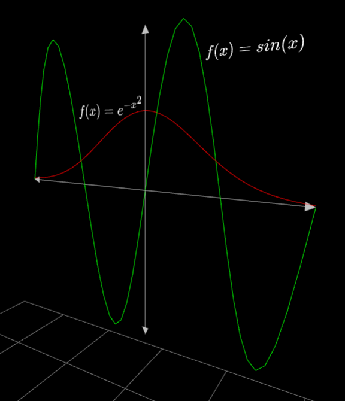

# Tactile - VR data visualization
## Try it out!
Visit https://ctrekker.github.io/Tactile/ to check it out! The scene below will render (outdated, something different will appear now), and if you open the page on a VR-compatible device you can interact with it in 3D!



## Development
To start the WebPack development server,
```
npm run start
```
This will hotload any changes to JavaScript files and refresh your browser window. By default the server is hosted at `localhost:9000`.

## Features
### Visualizations
- [x] Basic 2D line plots
- [x] LaTeX support!!
- [x] Plotting 3D parametric lines
- [ ] Plotting 3D functions / 2D surfaces
- [ ] Plotting 3D parametric surfaces
- [ ] Bar plotting 2D (bar, histogram)
- [ ] Voxel plotting 3D
- [ ] Generic 3D model import
- [ ] Graph / tree rendering
  - [ ] Mollecular modeling?
- [ ] Image / heatmap rendering

### Interactivity
- [ ] Visualization selection and editing
  - [ ] Selection view?
  - [ ] Placement (position, rotation) interactivity
  - [ ] Sizing interactivity
- [ ] Movement tools avoiding motion-sickness effects
- [ ] Standard slider interface
- [ ] Time-based visualization animations

## User Stories
* Connor, a student, wants an interesting way to interact with Calculus concepts introduced in class more visually
* Connor also wants an easy way to build simulations in 3D that aren't painful to interact with
* Frank wants to create an interactive room to serve as a teaching tool for projectile motion physics
* Jane wants to interact with statistical distributions from an online dataset
* Frank also wants to make a similar room for various optics concepts, such as curved mirrors, lenses, reflection, refraction, and diffraction
* Jack has a convolutional neural network that he thinks could be interesting to see in real 3D
* A national park wants to showcase their land's topography in a more interactive way than 3D topographical map tables

**NOTE**: The site must use `https` in order for the VR browser to allow entering VR mode.
